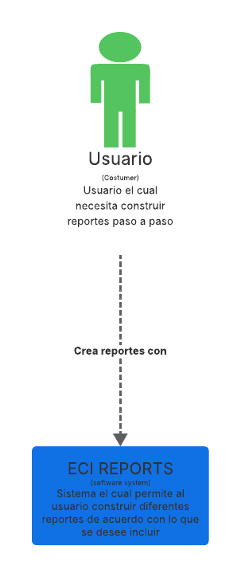
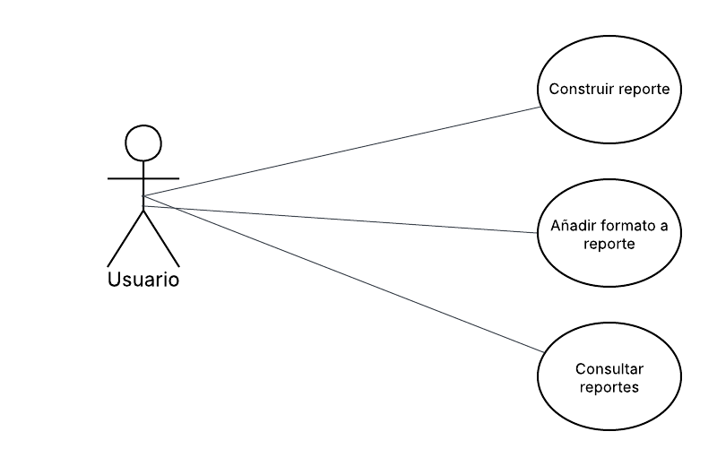
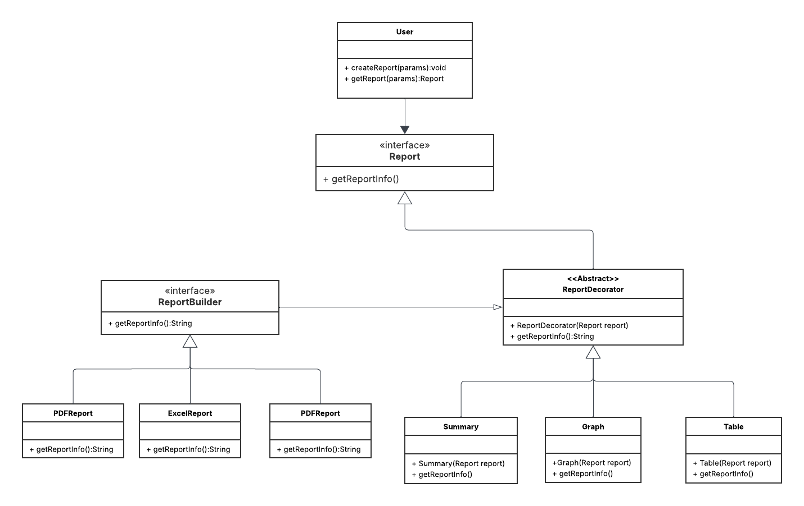
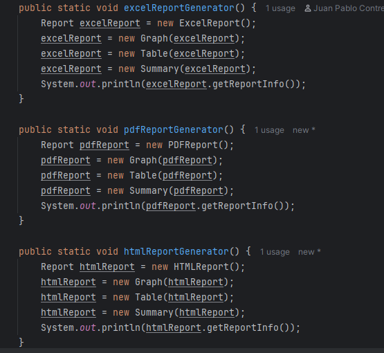
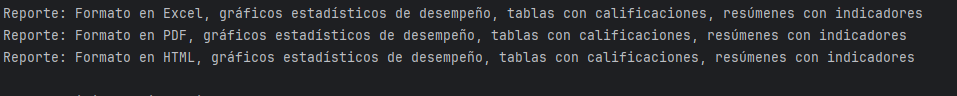

# Parcial Corte 1 - CVDS DOSW

---

## Autor
**Juan Pablo Contreras**

---

## 1. Descripción del Sistema

Este proyecto implementa un sistema de generación de reportes académicos para una universidad, permitiendo a los docentes exportar información en múltiples formatos (PDF, Excel, HTML) y personalizar los reportes con elementos como tablas de calificaciones, gráficos estadísticos de desempeño y resúmenes con indicadores. El sistema está diseñado para ser flexible, permitiendo la construcción incremental de reportes y la adición de nuevas características visuales sin modificar las clases existentes.

**Diagrama de Contexto**  

---

## 2. Funcionalidades Principales

- **Creación de Reportes**: Los usuarios pueden generar reportes en formatos PDF, Excel o HTML.
- **Personalización**: Los reportes pueden incluir elementos opcionales como tablas, gráficos y resúmenes.
- **Extensibilidad**: El sistema permite agregar nuevas características visuales (e.g., mapas de calor) sin modificar el código base.

### Casos de Uso

---

## 3. Diseño del Sistema

### Diagrama de Clases
El diseño se basa en una arquitectura modular que utiliza patrones de diseño para cumplir con los requisitos de flexibilidad y extensibilidad.

### Principios SOLID Aplicados

#### 1. Single Responsibility Principle (SRP)
Cada clase tiene una única responsabilidad. Por ejemplo:
- Las clases `PDFReport`, `ExcelReport` y `HTMLReport` solo definen el formato base del reporte.
- Las clases decoradoras (`Summary`, `Table`, `Graph`) solo añaden funcionalidades específicas.  
  Esto asegura que las clases sean fáciles de mantener y modificar.

#### 2. Open/Closed Principle (OCP)
Las clases están abiertas a extensión pero cerradas a modificación.
- La clase abstracta `ReportDecorator` permite añadir nuevas funcionalidades (e.g., mapas de calor) creando nuevos decoradores sin alterar las clases base (`PDFReport`, etc.).
- Esto cumple con el requisito de agregar nuevas visualizaciones en el futuro.

#### 3. Interface Segregation Principle (ISP)
La interfaz `Report` es minimalista, definiendo solo el método `getReportInfo()`.
- Los clientes (como `User` o decoradores) no se ven obligados a implementar métodos innecesarios.
- Cada decorador usa solo la interfaz `Report`, manteniendo la modularidad.

---

## 4. Patrones de Diseño Implementados

### 1. Builder
**Tipo**: Creacional  
**Justificación**:  
El patrón Builder permite construir reportes de manera incremental, como se especifica en los requisitos ("construir reportes paso a paso"). Aunque la implementación actual de `ReportBuilder` extiende `ReportDecorator`, podría refactorizarse para ser un verdadero builder con una interfaz fluida (e.g., `.withFormat("PDF").addTable().build()`). Esto facilita la configuración dinámica de reportes.

### 2. Decorator
**Tipo**: Estructural  
**Justificación**:  
El patrón Decorator permite añadir funcionalidades (tablas, gráficos, resúmenes) a un reporte base sin modificar su estructura original. La clase abstracta `ReportDecorator` y sus implementaciones (`Summary`, `Table`, `Graph`) envuelven un reporte base, concatenando funcionalidades de forma composable. Esto cumple con el requisito de extensibilidad para nuevas visualizaciones.

---

## 5. Evidencias de Ejecución

La clase `ParcialCorte1CvdsDoswApplication` demuestra la funcionalidad del sistema generando reportes en los tres formatos (Excel, PDF, HTML) con todos los elementos decorativos (gráficos, tablas, resúmenes).

**Código de Ejecución**  

**Salida en Consola**

---
